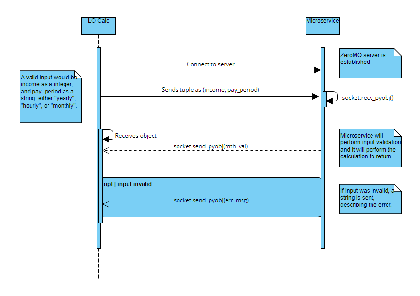

# LO-Calc-Microservice
A microservice for Josh Pulattie's Loan Application and Qualifying Calculator. Built to take a tuple input of (income, pay_period) and return an integer value that represents a client's monthly income. Also, has input validation; a string describing the error will be returned if input is invalid.

## Communication Contract
[Communication Contract pdf](./Communication%20Contract.pdf)

## Required Library
ZeroMQ is required as stated in the requirements.txt.

## UML Sequence Diagram

